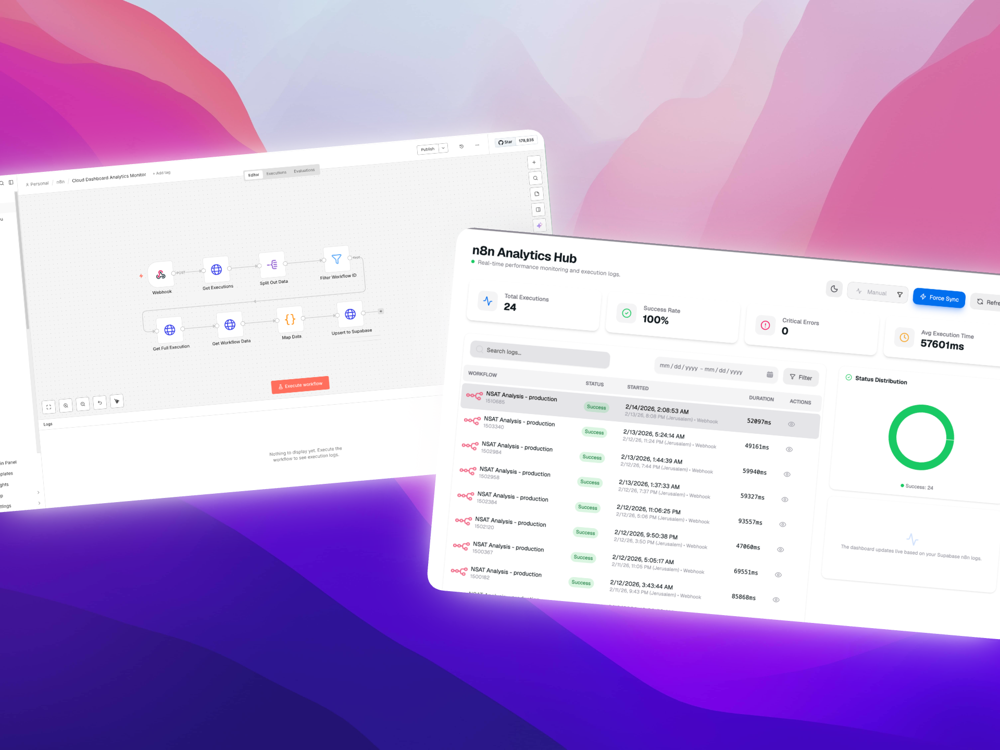

<div align="center">

# 👋 Hello, I'm Louie
[](https://git.io/typing-svg)

### Senior IT Administrator • Automation Developer


---
Building secure systems and streamlining workflows for modern teams.

[](https://louie.mendezdev.online/)
[](https://www.linkedin.com/in/louie-mendez/)
[](https://github.com/SimplyLouie)
[](mailto:inquiries.mendez@gmail.com)


</div>

---

## 🚀 About Me

I help teams work **securely and efficiently** by improving IT operations, automating repetitive processes, and connecting business tools into reliable workflows. My focus is on reducing manual effort and building scalable internal systems.

📍 **Cebu, Philippines**  
💼 **Actively seeking** new opportunities in **IT Operations, Identity, and Automation**

---

## 🛠️ Tech Stack & Expertise

<div align="left">

[](https://skillicons.dev)

</div>

### 🛡️ Identity & Automation
<div align="left">


</div>

### ☁️ Managed Cloud & Endpoint
<div align="left">


</div>

## ⚡ Automation & Workflow Design

<div align="center">
  
</div>

*I specialize in architecting complex, high-performance backends using **low-code** and **no-code** methodologies. I bridge the gap between traditional IT infrastructure and modern web applications through advanced automation.*

### 🛠️ Automation Capability
- **Backend Orchestration**: Designing event-driven architectures with **n8n** and **Webhooks**.
- **Data Transformation**: Expert in **JSON** processing and **REST API** integrations.
- **Full-Stack Automation**: Building "web functional" apps that connect user interfaces to automated backend logic.
- **Enterprise Scale**: Managing 50+ active workflows with high uptime and error-handling.

## 📈 Activity & Stats

<div align="center">

<picture>
  <source media="(prefers-color-scheme: dark)" srcset="https://github-profile-summary-cards.vercel.app/api/cards/profile-details?username=SimplyLouie&theme=github_dark">
  <source media="(prefers-color-scheme: light)" srcset="https://github-profile-summary-cards.vercel.app/api/cards/profile-details?username=SimplyLouie&theme=default">
  
</picture>

<picture>
  <source media="(prefers-color-scheme: dark)" srcset="https://github-readme-stats.vercel.app/api/top-langs/?username=SimplyLouie&layout=donut&theme=tokyonight&hide_border=true">
  <source media="(prefers-color-scheme: light)" srcset="https://github-readme-stats.vercel.app/api/top-langs/?username=SimplyLouie&layout=donut&theme=default&hide_border=true">
  
</picture>

<picture>
  <source media="(prefers-color-scheme: dark)" srcset="https://github-readme-stats.vercel.app/api/wakatime?username=simplylouie&theme=tokyonight&layout=compact&hide_border=true">
  <source media="(prefers-color-scheme: light)" srcset="https://github-readme-stats.vercel.app/api/wakatime?username=simplylouie&theme=default&layout=compact&hide_border=true">
  
</picture>

<a href="https://discord.com/users/284276567960584192">
  
</a>

</div>

[](https://git.io/streak-stats)

### 📊 Weekly Coding Breakdown
<!--START_SECTION:waka-->


**🐱 My GitHub Data** 

> 📦 ? Used in GitHub's Storage 
 > 
> 🏆 1,002 Contributions in the Year 2026
 > 
> 💼 Opted to Hire
 > 
> 📜 21 Public Repositories 
 > 
> 🔑 0 Private Repositories 
 > 
**I'm a Night 🦉** 

```text
🌞 Morning                570 commits         █████████░░░░░░░░░░░░░░░░   35.96 % 
🌆 Daytime                54 commits          █░░░░░░░░░░░░░░░░░░░░░░░░   03.41 % 
🌃 Evening                199 commits         ███░░░░░░░░░░░░░░░░░░░░░░   12.56 % 
🌙 Night                  762 commits         ████████████░░░░░░░░░░░░░   48.08 % 
```
📅 **I'm Most Productive on Saturday** 

```text
Monday                   101 commits         ██░░░░░░░░░░░░░░░░░░░░░░░   06.37 % 
Tuesday                  216 commits         ███░░░░░░░░░░░░░░░░░░░░░░   13.63 % 
Wednesday                197 commits         ███░░░░░░░░░░░░░░░░░░░░░░   12.43 % 
Thursday                 197 commits         ███░░░░░░░░░░░░░░░░░░░░░░   12.43 % 
Friday                   347 commits         █████░░░░░░░░░░░░░░░░░░░░   21.89 % 
Saturday                 407 commits         ██████░░░░░░░░░░░░░░░░░░░   25.68 % 
Sunday                   120 commits         ██░░░░░░░░░░░░░░░░░░░░░░░   07.57 % 
```


📊 **This Week I Spent My Time On** 

```text
🕑︎ Time Zone: Asia/Manila

💬 Programming Languages: 
TypeScript               3 hrs 39 mins       ███████████░░░░░░░░░░░░░░   44.57 % 
Other                    1 hr 54 mins        ██████░░░░░░░░░░░░░░░░░░░   23.17 % 
Bash                     1 hr 37 mins        █████░░░░░░░░░░░░░░░░░░░░   19.83 % 
Markdown                 21 mins             █░░░░░░░░░░░░░░░░░░░░░░░░   04.36 % 
JSON                     21 mins             █░░░░░░░░░░░░░░░░░░░░░░░░   04.28 % 

🔥 Editors: 
Antigravity              7 hrs 6 mins        ██████████████████████░░░   86.45 % 
Cursor                   1 hr 6 mins         ███░░░░░░░░░░░░░░░░░░░░░░   13.51 % 
VS Code                  0 secs              ░░░░░░░░░░░░░░░░░░░░░░░░░   00.04 % 

💻 Operating System: 
Mac                      8 hrs 13 mins       █████████████████████████   100.00 % 
```

**I Mostly Code in TypeScript** 

```text
TypeScript               21 repos            ██████████████████░░░░░░░   72.41 % 
JavaScript               5 repos             ████░░░░░░░░░░░░░░░░░░░░░   17.24 % 
MDX                      1 repo              █░░░░░░░░░░░░░░░░░░░░░░░░   03.45 % 
CSS                      1 repo              █░░░░░░░░░░░░░░░░░░░░░░░░   03.45 % 
Batchfile                1 repo              █░░░░░░░░░░░░░░░░░░░░░░░░   03.45 % 
```


 Last Updated on 07/04/2026 12:14:29 UTC
<!--END_SECTION:waka-->


---

<div align="center">
  <h3>Let's Connect!</h3>
  <p>I'm always open to discussing IT operations, automation, or identity management.</p>
</div>